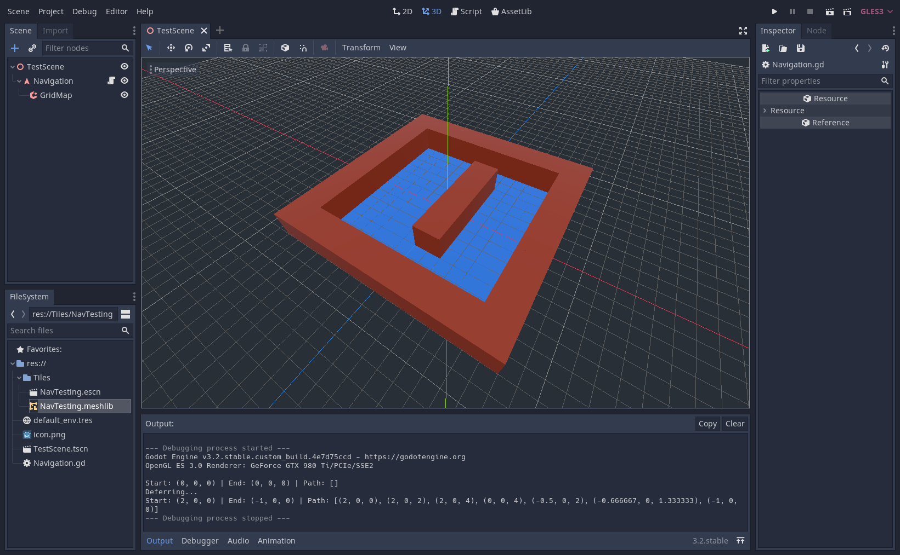

# GridMapNavigationBug

This Godot 3.2 project reproduces an issue involving the use of the Navigation node with a GridMap, as well as how to resolve the issue. `TestScene.tscn` contains a Navigation node with a child GridMap node. Navigation has a small script on it (Navigation.gd) that makes two calls to the method `_path_test()`. `_path_test()` is a brief method that attempts to find two Navigation points using `get_closest_point()` and a path between them using `get_simple_path()`. The results are printed to the console.

On the first call the output is invalid (both points are (0, 0, 0) and the path is an empty array), but on the deferred call the output is correct. I'm unsure if this is a bug, or if the methods in which Navigation calculates paths just can't be called on the first frame and this functionality is undocumented.
